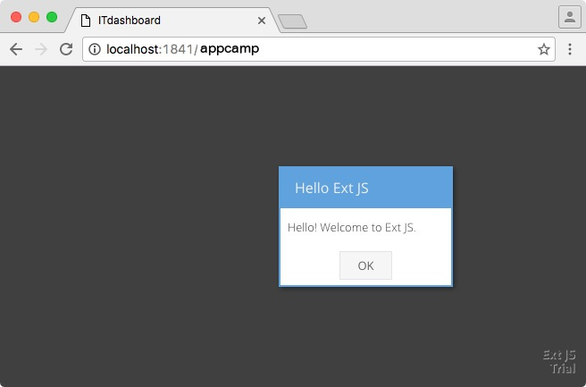

# Ext JS 6 - App Camp Setup Instructions

Prior to attending the Ext JS App Camp, please follow the setup instructions below on your laptop. You will need to bring your laptop at the AppCamp

## Step 1: Obtain a Text editor or IDE

You are free to use any IDE you wish. If you don't have one, consider downloading [Visual Studio Code](http://code.visualstudio.com/) which works on macOS, Linux, or Windows. Other good options include Visual Studio, Eclipse, and WebStorm. Notepad is strongly discouraged. 

## Step 2: Create the Course Folder

Create a folder to hold your work. It is strongly encouraged that you don't call the folder something else. For Windows users who don't have access their root C drive folder, you can put the SenchaTraining folder inside your users folder or another location. 

* Windows: C:\SenchaTraining\
* Mac / Linux : ~/SenchaTraining/


## Step 3: Obtain Ext JS Trial or Commercial

1. Download the Trial version of Ext JS 6.2 from [here](https://www.sencha.com/products/extjs/evaluate/). You will get an email which contains the link to Ext JS 6. If you already own an Ext JS 6.2 license, please download it from [support.sencha.com](http://support.sencha.com) using your credentials 
2. Unzip the SDK into the SenchaTraining folder and change the SDK folder's name to ext. 

WARNING: When you unzip the folder, it will unzip as ext-6.2.x, you will need to rename it to ext

When you are done, your folder structure will look like this:

```
SenchaTraining/
├── ext 
```

## Step 4: Install Sencha Cmd 6.2+

1. Download Sencha Cmd from [http://www.sencha.com/products/sencha-cmd/download](http://www.sencha.com/products/sencha-cmd/download) — choose the option that includes the Java JRE.
2. Run the Sencha Cmd installer. WARNING: Do NOT change the directory the installer recommends using for the installation. A common mistake is to install Sencha Cmd in the SenchaTraining folder. Please do not do this. 


## Step 4: Create a Sencha Cmd Workspace

On macOS, in a fresh terminal window, go to the SenchaTraining folder and type in the following command:
```
sencha generate workspace ~/SenchaTraining/
```

On Windows, on Command Prompt, generate a workspace using the following command
```
sencha generate workspace C:\SenchaTraining
```

After running command above, SenchaTraining folder should look like this
```
SenchaTraining/
├── ext/
├── packages/
├── workspace.json
```

## Step 5: Install Ext JS Premium Addons

1. In Step 2, we received an email from downloads@sencha.com upon completing the form to download Ext JS Trial which contained the link for Ext JS 6 Trial. This email also contains the link for "Pivot Grid, D3 Adapter, Calendar, and Exporter add-ons". Please download the addons. If you have an Ext JS Premium license, you can download the Addons from the [Support Portal](http://support.sencha.com). The addons in the Support Portal are called "Ext Premium Addons" and available under the Download section of the site.
2. After you unzip the file, copy only the folders located inside of the packages subdirectory of the newly extracted file into the SenchaTraining/packages directory.

After completing this step, you folder structure should look like this

```
SenchaTraining/
├── ext/
├── packages/
    ├── calendar/
    ├── d3/
    ├── exporter/
    ├── pivot/
    ├── pivot-d3/
    ├── pivot-locale/
├── workspace.json

```
## Step 6: Check your installation

* In the SenchaTraining/ folder run the following command via Terminal / Command Prompt.
```
sencha web start
```

You should see something like this upon running the command
```
$ sencha web start
Sencha Cmd v6.2.0.103
[INF] Starting server on port : 1841
[INF] Mapping http://localhost:1841/ to ....
[INF] Server started at port : 1841

```
Troubleshooting: If the sencha command is not found, open a new terminal or command prompt window and try again. 

* Do not close this Terminal / Command Prompt window until you are done with the Setup Instructions. You may wish to minimize this window to avoid accidently closing this window. 

* Now visit the following site [http://localhost:1841/](http://localhost:1841) and ensure you can see the following:


* After you click on the ext folder. You should see the following:

 

## Step 7: HelloWorld Test

* In the SenchaTraining folder, type in the following three commands in terminal / Command Prompt

```
sencha -sdk ext generate app -starter=false -modern AppCamp appcamp
cd appcamp
sencha app build development
```
Troubleshooting: Make sure you have a SenchaTraining/ext directory. If you don't, re-check step 3. 

* Visit the following site [http://localhost:1841/appcamp/](http://localhost:1841/appcamp/) and ensure you can see the following:



## Step 8: Install Node.js

* Download and install the Current verison of [Node.js](http://www.nodejs.org). 

## Step 9: Install Google Chrome

* Download and Install Chrome from [here](https://www.google.com/intl/en/chrome/). We will need Google Chrome for debugging our apps.

## Step 10 (Optional): Install Cordova

This step is optional. We will be covering how to package your apps for mobile devices (Android). Some students who aren't interested in this just prefer to watch and therefore do not need this installed.

* Download and install [Java SE JDK](http://www.oracle.com/technetwork/java/javase/downloads/index.html) if you don't have it already
* Windows Users: Make sure Java is set in your environment variable
* Windows Users: Make sure your [JAVA_HOME](https://docs.oracle.com/cd/E19182-01/820-7851/inst_cli_jdk_javahome_t/) environment variable is set
* Download and install [Android Studio](https://developer.android.com/studio/install.html) or the [Android Command Line Tools](https://developer.android.com/studio/index.html) (which is much smaller in file size)
* Run the following command from a new Terminal or Command Prompt window

```
npm install -g cordova
```
If npm is not found, please open a new terminal or commmand prompt window and try again
 
## Step 11 (Optional): macOS and Linux attendees only - Install Wine

This step is optional.  If you wish to learn how to package your Ext JS apps on Mac to create an executable binary (.exe files) for Windows, you will need to complete this step. If you choose not to follow this step, you will still be able to package your apps for macOS(.app files) and Linux to create executable binaries.

* If you have [MacPorts](https://www.macports.org) installed, run the following command:
```
sudo port install wine
```
Note: the command above may run for 30 minutes or more depending on your internet connection speed

If you don't have MacPorts installed, I recommend you skip this step as it's optional. [Installing Wine manually](https://www.winehq.org/download) without MacPorts can be a challenging process for some due to the number of dependencies. Not having completed this step will not impact your learning process. 


## Troubleshooting

* Make sure you are executing the command in the correct directory. Over 50% of issues are a result of this.
* In some cases, you may need to close the Terminal or Command Prompt window and reopen it. This is done to ensure that all your installed software is loaded in the path.
* If you already have something running on port 1841, Sencha Cmd will choose another port. Instructions refer to port 1841, please substitute port in browser 