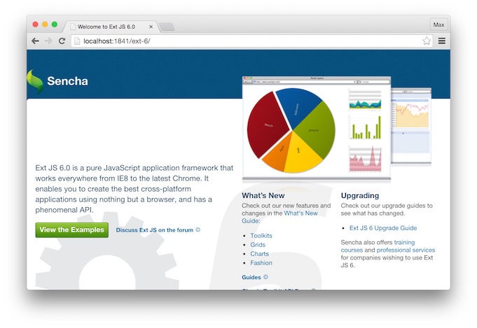

# Ext JS 6 - App Camp Setup Instructions

Prior to attending the Ext JS App Camp, please follow the setup instructions below. You will need to bring your laptop at the AppCamp

## Step 1: Obtain a Text editor or IDE

You are free to use any IDE you wish. If you don't have one, consider downloading [Visual Studio Code](http://code.visualstudio.com/) which works on macOS, Linux, or Windows. Other good options include Visual Studio, Eclipse, and WebStorm. Please avoid using notepad. 

## Step 2: Create the Course Folder

**Create a folder to hold your work**

* Windows: C:\SenchaTraining\
* Mac / Linux : ~/SenchaTraining/


## Step 3: Obtain Ext JS Trial or Commercial

1. Download the Trial version of Ext JS 6.2 from [here](https://www.sencha.com/products/extjs/evaluate/). You will get an email which contains the link to Ext JS 6. If you already own an Ext JS 6.2 license, please download it from [support.sencha.com](support.sencha.com) using your credentials 
2. Unzip the SDK into the SenchaTraining folder and change the SDK folder's name to ext. 

WARNING: When you unzip the folder, it will unzip as ext-6.2.x, you will need to rename it to ext

When you are done, your folder structure will look like this:

```
SenchaTraining/
├── ext 
```

## Step 4: Install Sencha Cmd 6.2+

1. Download Sencha Cmd from [http://www.sencha.com/products/sencha-cmd/download](http://www.sencha.com/products/sencha-cmd/download) — choose the option that includes the Java JRE.
2. Run the Sencha Cmd installer. WARNING: Do NOT change the directory it wishes to use for the installation. You will NOT be installing Sencha Cmd in the SenchaTraining directory. 


## Step 4: Create a Sencha Cmd Workspace

On macOS, in a fresh terminal window type in the following command:
```
sencha generate workspace ~/SenchaTraining/
```

On Windows, on Command Prompt, generate a workspace using the following command
```
sencha generate workspace C:\SenchaTraining
```

After running command above, SenchaTraining folder should look like this
```
SenchaTraining/
├── ext/
├── packages/
├── workspace.json

```


## Step 5: Install Ext JS Premium Addons

1. In Step 2, we received an email upon completing the Ext JS form for Ext JS Trial which contained the link for Ext JS. This email also contains the link for "Pivot Grid, D3 Adapter, Calendar, and Exporter add-ons". Please download the addons. If you have an Ext JS Premium license, you can download the adds from the [Support Portal](). The addons are called "Ext Premium Addons".
2. After you unzip the file, copy only the folders located inside of the packages subdirectory into the SenchaTraining/packages directory.

After completing this step, you folder structure should look like this

```
SenchaTraining/
├── ext/
├── packages/
    ├── calendar/
    ├── d3/
    ├── exporter/
    ├── pivot/
    ├── pivot-d3/
    ├── pivot-locale/
├── workspace.json

```
## Step 6: Check your installation

* In the SenchaTraining/ folder run the following command via Terminal / Command Prompt
```
sencha web start
```

You should see something like this upon running the command
```
$ sencha web start
Sencha Cmd v6.2.0.103
[INF] Starting server on port : 1841
[INF] Mapping http://localhost:1841/ to ....
[INF] Server started at port : 1841

```

* Now visit the following site [http://localhost:1841/](http://localhost:1841) and ensure you can see the following:


* After you click on the ext folder. You should see the following:

 

## Step 7: Install Node.js

* Download and install [Node.js](nodejs.org)

## Step 8: Install Google Chrome

* Download and Install Chrome from [here](https://www.google.com/intl/en/chrome/). We will need Google Chrome for debugging our apps.

## Step 9: (Optional) macOS users only - You will need to install Wine

This step is optional if you wish to learn how to package your apps to create an executable binary (exe files) for Windows. If you choose not to follow this step, you will still be able to package your apps for macOS.

* If you have [MacPorts](macports.org) installed, run the following command:
```
sudo port install wine
```
Note: the command above may run for 30 minutes or more. 

If you don't have MacPorts install, I recommend you skip this step. Installing Wine can be a challenging process due to the number of dependencies it has. Homebrew can also be used to install Wine

