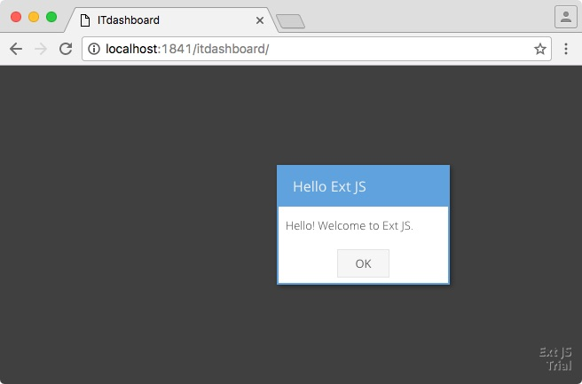
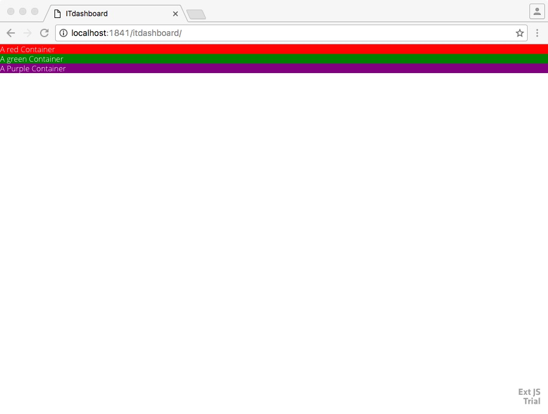
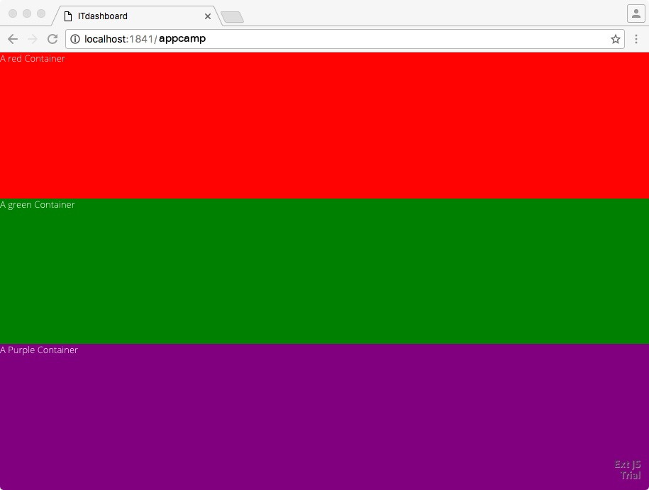
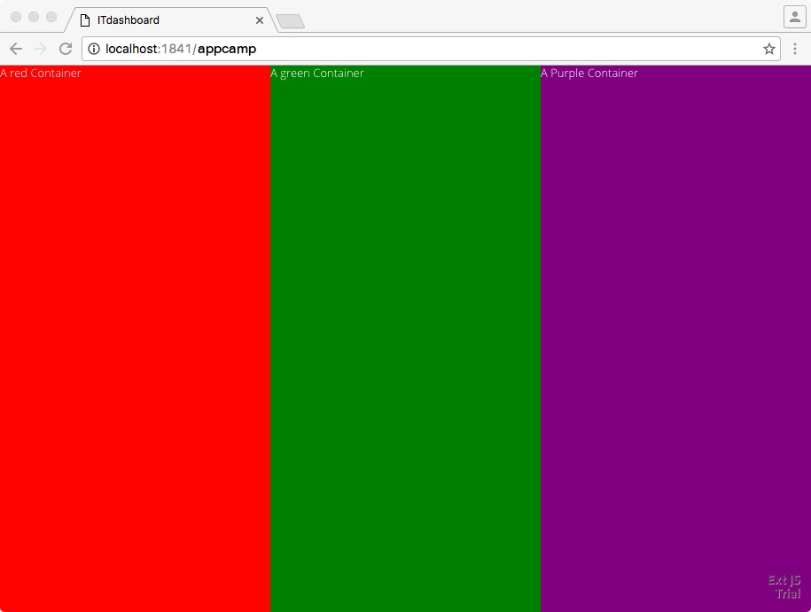
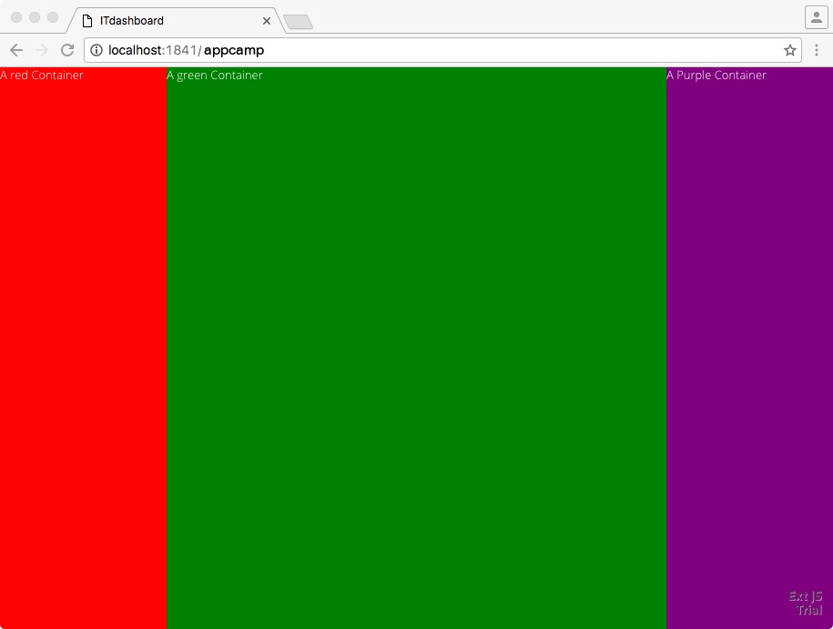

# App Camp - LAB 2

In this lab, we will get an introduction to layouts and containers


## Step 1: Start the Sencha Web Server with Live Reload

If you have "sencha web start" command running, close it and in a separate Command Prompt or Terminal window run the following command in the SenchaTraining/appcamp folder:

```
sencha app watch
```

If your web-server starts correctly, you should see this:
```
$ sencha app watch
Sencha Cmd v6.2.0.103
[INF] Processing Build Descriptor : default
[INF] Starting server on port : 1841
[INF] Mapping http://localhost:1841/~cmd to /Users/shikhir/bin/Sencha/Cmd/6.2.0.103...
[INF] Mapping http://localhost:1841/ to /Users/shikhir/SenchaTraining...
[INF] Server started at port : 1841
[INF] Application available at http://localhost:1841
[INF] Loading app json manifest...
[INF] Appending content to /Users/shikhir/SenchaTraining/appcamp/bootstrap.js
[INF] Writing content to /Users/shikhir/SenchaTraining/appcamp/bootstrap.json
[INF] merging 375 input resources into /Users/shikhir/SenchaTraining/build/development/AppCamp/resources
[INF] merged 1 resources into /Users/shikhir/SenchaTraining/build/development/AppCamp/resources
[INF] merging 17 input resources into /Users/shikhir/SenchaTraining/build/development/AppCamp
[INF] merged 1 resources into /Users/shikhir/SenchaTraining/build/development/AppCamp
[INF] Writing content to /Users/shikhir/SenchaTraining/appcamp/sass/example/bootstrap.json
[INF] Writing content to /Users/shikhir/SenchaTraining/appcamp/sass/example/bootstrap.js
[INF] writing sass content to /Users/shikhir/SenchaTraining/build/temp/development/AppCamp/sass/AppCamp-all.scss.tmp
[INF] appending sass content to /Users/shikhir/SenchaTraining/build/temp/development/AppCamp/sass/AppCamp-all.scss.tmp
[INF] appending sass content to /Users/shikhir/SenchaTraining/build/temp/development/AppCamp/sass/AppCamp-all.scss.tmp
[INF] Writing content to /Users/shikhir/SenchaTraining/build/development/AppCamp/app.json
[LOG] Building /Users/shikhir/SenchaTraining/build/temp/development/AppCamp/sass/AppCamp-all.scss
Exiting with code 0
[INF] Appending content to /Users/shikhir/SenchaTraining/appcamp/bootstrap.js
[INF] Writing content to /Users/shikhir/SenchaTraining/appcamp/bootstrap.json
[INF] Waiting for changes...
```

We will need to keep this Command Prompt or Terminal window open for the rest of the App Camp. Minimize this window and don't close it for the remainder of the AppCamp

## Step 3: Test your App

* Visit [http://localhost:1841](http://localhost:1841/appcamp/)

You should see the following:



## Step 4: Add Containers

* Open the following line of file in your IDE: SenchaTraining/appcamp/app.js
* Remove the line inside the launch function (line #9)
* Paste this inside the launch function

```
		Ext.Viewport.add(
			{
				xtype: 'container',
				id: 'root',
				// layout: 'vbox',
				items: [
					{
						xtype: 'container', 
						html: 'A red Container',
						// flex: 1,						
                        style: 'background-color: red; color: white', 
						title: "red",

					},
					{
						xtype: 'container', 
						html: 'A green Container',
                        // flex: 1,
						style: 'background: green; color:white'
					},
					{
						xtype: 'container', 
						html: 'A Purple Container',
						// flex: 1,
                        style: 'background: purple; color: white'
					}					
					
				]
			}
		);
```
* Save the file and revisit the site [http://localhost:1841](http://localhost:1841/appcamp/) in Google Chrome. It should look like below:


* At the end of this step, your app.js file should look like [this](step4.js)

## Step 5: Understand layout

* Uncomment the "layout" property
* Uncomment the three lines that contain the "flex" properties
* Save the file and revisit the site [http://localhost:1841](http://localhost:1841/appcamp/) in Google Chrome. It should look like below:



* Change the "layout" property to 'hbox' from 'vbox'. Save the file and revisit the site [http://localhost:1841](http://localhost:1841/appcamp/) in Google Chrome. It should look like below:



## Step 6: understanding the card layout
* Change the layout to 'card' and go to the JavaScript console (menu under View > Developer > JavaScript console)
* In the console, type in the following

```
Ext.getCmp('root').setActiveItem(1); // now change the values to 0, 1, 2 in the function
```
* Change the values inside setActive item to 2
* Change the values inside setActive item to 0

## Step 7: Undstanding flex and width

* Change the "layout" property in app.js back to 'hbox' from 'card'
* The value of the "flex" property for all the containers is set to one. Change the value of flex for the the middle container to 3. Notice how the middle container doubled in size.



* Change the size of the browser. Notice how the ratios of the width of each container stays the same
* Now comment out the middle container's flex property
* Add a new "width" property in the middle container with a value of '200px'. So your middle container should look like this:
```
					{
						xtype: 'container', 
						html: 'A green Container',
						//flex: 3,
						width: '100px',
						style: 'background: green; color:white'
					},

```
 
* Change the size of the browser window and note how the two edge containers change size although the middle container now stays fixed
* At the end of this step, your app.js file should look like [this](step7.js)