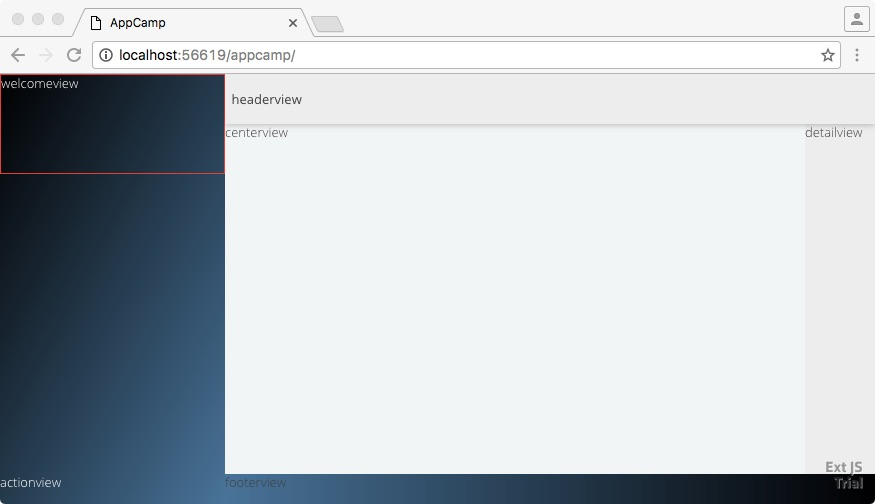

# App Camp - LAB 4

In this lab, we will move all our Containers to their own classes and theme them via sass


## Step 1: Update Application.js and replace the launch function with the following

* Let's edit Application.js and replace the launch function with the following:
```
	launch: function () {
			Ext.Viewport.add({ xtype: 'mainview' }); // we are now adding another view class
	},
```

* Create a subdirectory inside the app directory called view
* Create a subdirectory inside the view directory called main

As a result, at this point your new directory structure inside your appcamp directory should look like this:
```
appcamp/
├── app/
    ├── Application.js
    ├── view/
        ├── main/
├── app.js
├── app.json
...
├── sass/
```

* * Under the "name" property in Application.js, add a new line with the following, and save the file:
```
	requires: ['AppCamp.view.main.MainView'],   // the sub-namespace correspond to directory names you just created. "requires" are like #include in C++
```

* Inside the main subdirectory create a new file called MainView.js and copy it's contents from below:
```
Ext.define('AppCamp.view.main.MainView',{
	extend: 'Ext.Container',
	xtype: 'mainview', // we are giving our own symbolic name to this class
	layout: 'hbox',
	cls: 'mainview', // this is a css class name for this class
	requires: [  // similar to #include
        'AppCamp.view.main.SideBarView',
        'AppCamp.view.main.HeaderView',
        'AppCamp.view.main.CenterView',
        'AppCamp.view.main.FooterView',
        //'AppCamp.view.main.MainViewController',
        'AppCamp.view.main.DetailView'
    ],

	//reference: 'mainview',   // TO BE DEFINED LATER
	//controller: 'mainview',
	//viewModel: 'mainview',
	items: [
		{
			xtype: 'sidebarview', 
			width: 225
		},
		{
			xtype: 'container',
			flex: 1,
			layout: 'vbox',
			items: [
				{
					xtype: 'headerview',
					height: 50,
					docked: 'top'
				},
				{
					xtype: 'container',
					flex: 1,
					layout: 'hbox',
					items: [
						{
							xtype: 'centerview',
							flex: 1
						},
						{
							xtype: 'detailview',
							width: 70
						}
					]
				},
				{
					xtype: 'footerview',
					height: 30,
					docked: 'bottom'
				}
			]
		}
	]
});
```


## Step 2: Add new files for each new container class

* Create a the file app/view/main/SidebarView.js with the following content
```
Ext.define('AppCamp.view.main.SideBarView',{
	extend: 'Ext.Container',
	xtype: 'sidebarview',
	cls: 'sidebarview', // css class defined in /appcamp/scss/src/view/main/SideBarView.scss
	layout: 'vbox',

    // ** Commented out - to be used later
    //requires: [
    //  'AppCamp.view.main.WelcomeView',
    //  'AppCamp.view.main.MenuView',
    //  'AppCamp.view.main.ActionView'
    //],
    
	scrollable: true,
	items: [
		//{ xtype: 'welcomeview', height: 100 },
		//{ xtype: 'menuview', flex: 1 },
		//{ xtype: 'actionview', height: 30 }
	]
});
```

* Create a the file app/view/main/HeaderView.js with the following content
```
Ext.define('AppCamp.view.main.HeaderView',{
	extend: 'Ext.Toolbar',
	xtype: 'headerview',
	cls: 'headerview', // css class defined in /appcamp/scss/src/view/main/HeaderView.scss
	
	// items: [
	// 	{ xtype: 'container', html: '<a class="headertitle" >The United States Federal Agency IT Dashboard (2016)</a>' }
	// ]
	html: 'headerview'

});
```

* Create a the file app/view/main/CenterView.js with the following content
```
Ext.define('AppCamp.view.main.CenterView',{
	extend: 'Ext.navigation.View',
	xtype: 'centerview',
	html: 'centerview',
	cls: 'centerview', // css class defined in /appcamp/scss/src/view/main/CenterView.scss
	
	navigationBar: false
});
```

* Create a the file app/view/main/DetailView.js with the following content
```
Ext.define('AppCamp.view.main.DetailView',{
	extend: 'Ext.Container',
	xtype: 'detailview',
	html: 'detailview',
	cls: 'detailview'  // css class defined in /appcamp/scss/src/view/main/DetailView.scss
});
```

* Create a the file app/view/main/FooterView.js with the following content
```
Ext.define('AppCamp.view.main.FooterView',{
	extend: 'Ext.Container',
	xtype: 'footerview',
	cls: 'footerview',  // css class defined in /appcamp/scss/src/view/main/FooterView.scss
	
	// items: [
	// 	{ xtype: 'container', html: '<span class="footercomment">Powered by Sencha ExtJS  -  Inspired by ITDASHBOARD.gov</span>' }
	// ]
	html: 'footerview'
    
});
```

* Visit [http://localhost:1841](http://localhost:1841/appcamp/), and notice there is no stying anymore. This is because the CSS variables are no longer present. 

# Step 3: Let's add SASS Styling

Next, we covert all css styling to SASS

* Unzip this file and move its contents to the /appcamp/sass/src/ directory

Your file structure should look like this after you are finished unzipping and moving the files
```
appcamp/
├── app/
├── app.js
...
├── resources/
├── sass/
    ├── etc/
    ├── example/
    ├── var/
    ├── src/
        ├── view/
            ├── dashboard/
            ├── lab02/
            ├── login/
            ├── main/
            ├── phone/
```

* Take a look at some of the .sass files inside the appcamp/src/view/main/. Notice that the it's the same css as in the last lab.
* Visit [http://localhost:1841](http://localhost:1841/appcamp/)

You should see the following:


# Step 4: Let's fix the sidebarview

Let's put three containers in the sidebar. 

* Create a the file app/view/main/WelcomeView.js with the following content
```
Ext.define('AppCamp.view.main.WelcomeView',{
	extend: 'Ext.Container',
	xtype: 'welcomeview',
	html: 'welcomeview',
	cls: 'welcomeview'
});
```

* Create a the file app/view/main/ActionView.js with the following content
```
Ext.define('AppCamp.view.main.ActionView',{
	extend: 'Ext.Container',
	xtype: 'actionview',
	html: 'actionview',
	cls: 'actionview'
});
```

* Create a the file app/view/main/MenuView.js with the following content
```
Ext.define('AppCamp.view.main.MenuView',{
    extend: 'Ext.list.Tree',
    xtype: 'menuview',
    reference: 'menuview',
    cls: 'menuview',
    requires: [
       // 'AppCamp.view.main.MenuViewModel',
        'Ext.data.TreeStore'
    ],

	ui: 'navigation',
	expanderFirst: false,
	expanderOnly: false
    /*
    listeners: {
		//selectionchange: 'onMenuViewSelectionChange'
	},

    viewModel: {
        type: 'main-menuview'
    },

    bind: {
        store: '{sidemenu}'
    }
    */
});
```

We now need to reference these files
* Uncomment the three items properties in app/view/main/Sidebar.js as well as all the requires

We should have something that looks like this:



# Files

Your files should look like this at then end of this lab

<a href="app/" target="_blank"> Files</a>